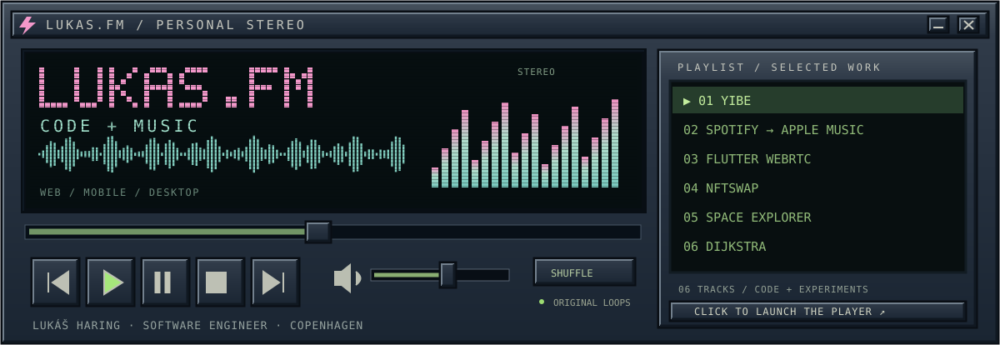

<a href="https://mrlukyman.github.io/mrlukyman/"><strong>▶ Launch the interactive player</strong></a> · pick a project, play a little chiptune, turn it up.

# Hey, I'm Lukáš.

**Software engineer in Copenhagen. Musician. Co-founder of [yibe](https://yibe.fm).**

I build web, mobile, and desktop apps, along with the backends that keep them running. My work ranges from consumer apps to software for scientific instruments. Music shows up in my side projects, too: a streaming project, a link-switching utility, and now this slightly nostalgic corner of GitHub.

[LinkedIn](https://www.linkedin.com/in/lukasharing/) · [yibe](https://yibe.fm) · [Work account](https://github.com/lukasharing-hl)

## The playlist

| Track | Project | What's playing |
| :--- | :--- | :--- |
| `01` | **[yibe](https://yibe.fm)** | A personalised music streaming project I'm co-founding. |
| `02` | **[Spotify → Apple Music](https://github.com/mrlukyman/spotify2applemusic)** | A macOS utility for opening Spotify links in Apple Music. Shell, Shortcuts, Finicky. |
| `03` | **[Flutter WebRTC · merged fix](https://github.com/flutter-webrtc/flutter-webrtc/pull/1854)** | Fixed screen-capture orientation for Android devices with landscape-native displays. |
| `04` | **[NFTSwap](https://github.com/mrlukyman/NFTSwap)** | A full-stack trading prototype: React, GraphQL, Prisma, PostgreSQL, and wallet integrations. |
| `05` | **[Space Explorer](https://github.com/mrlukyman/space-explorer)** | A small educational AR experiment built with SwiftUI, ARKit, and RealityKit. |
| `06` | **[Dijkstra visualiser](https://github.com/mrlukyman/dijkstra-algorithm-react)** | Watching a shortest-path algorithm find its way across a grid. TypeScript + React. |

## In the mix

**Web** · TypeScript, React, Next.js  
**Mobile & desktop** · React Native, Expo, Flutter, Dart, Electron, Kotlin  
**Backend & data** · Convex, GraphQL, Firebase, Supabase, Prisma, PostgreSQL  
**Shipping** · Native integrations, CI/CD, App Store & Google Play releases

<strong>Liner notes — professional work</strong>

- **Digital Fireworks:** mobile and web development with React Native, Expo, and Next.js, plus backend services, native platform integrations, and release automation.
- **HunterLab:** Flutter desktop and instrument software, remote viewing and control with WebRTC, Android camera integration, and kiosk-mode settings.
- **Continental:** React and Electron desktop development, working directly with the client on requirements and feedback.

Some of that work lives outside this account. My public projects above are a mix of experiments, utilities, and open-source contributions.

---

Have something interesting to build? I'm interested in software engineering opportunities across the stack. **[Let's talk.](https://www.linkedin.com/in/lukasharing/)**
